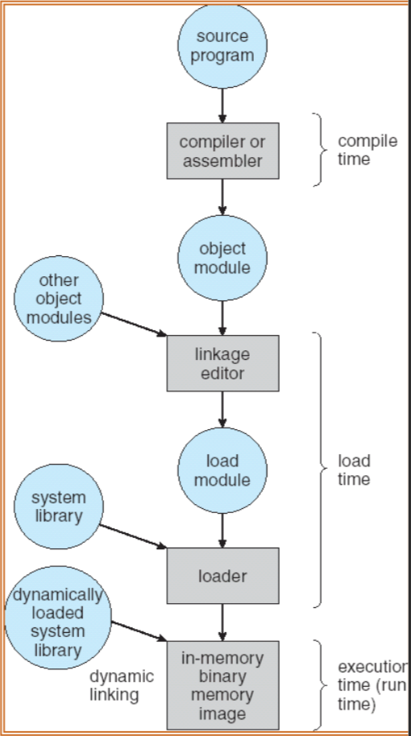
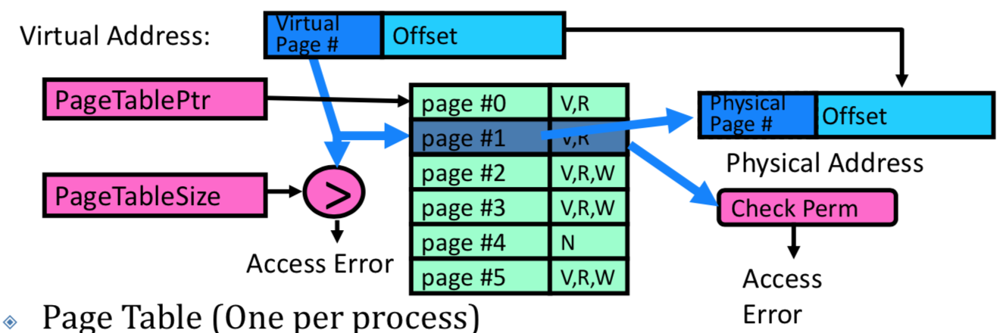
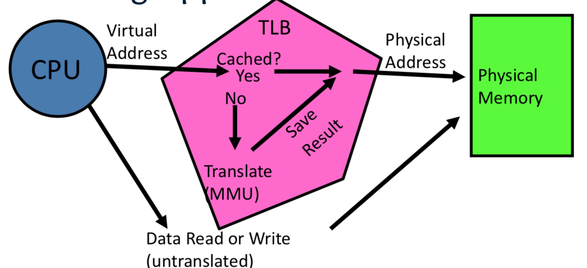
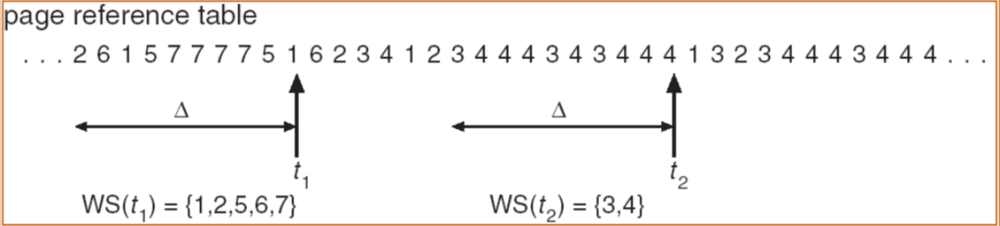
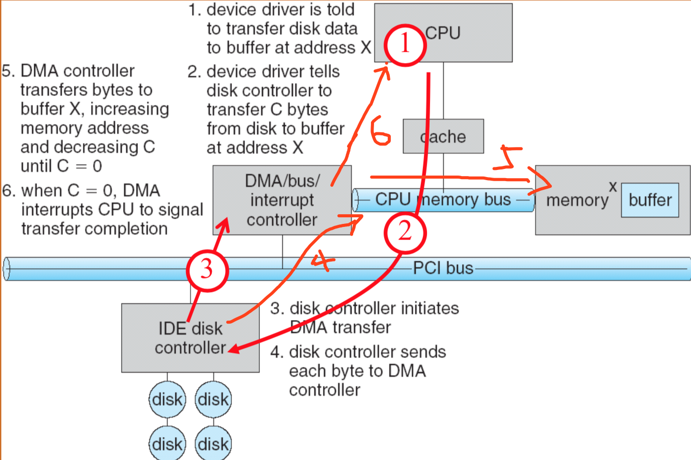
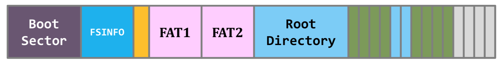
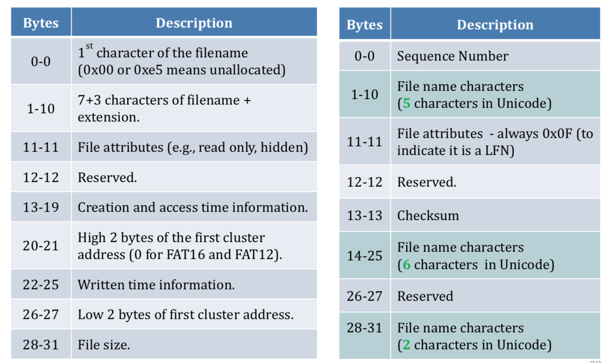
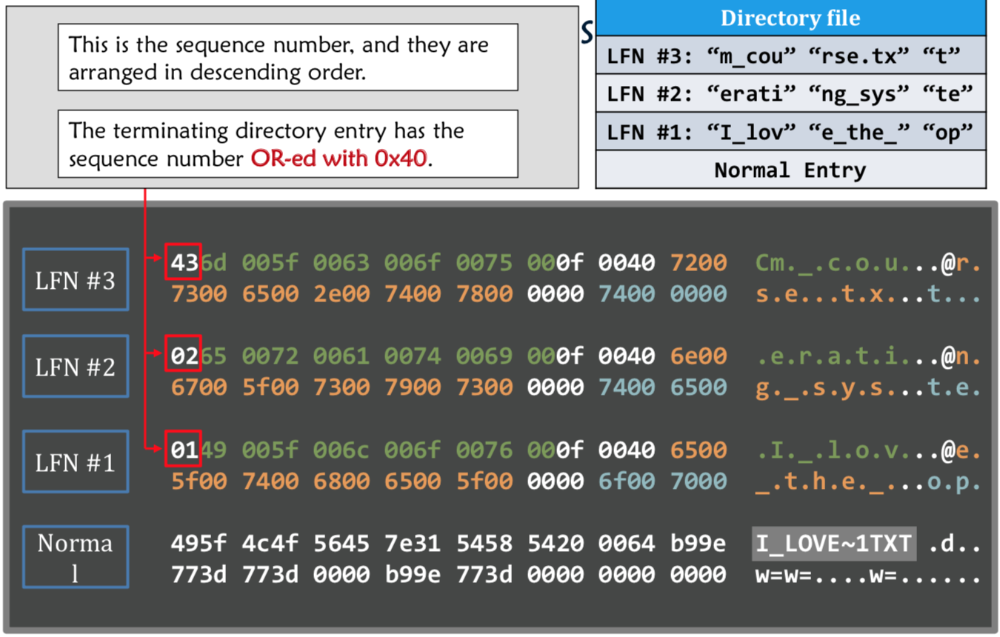
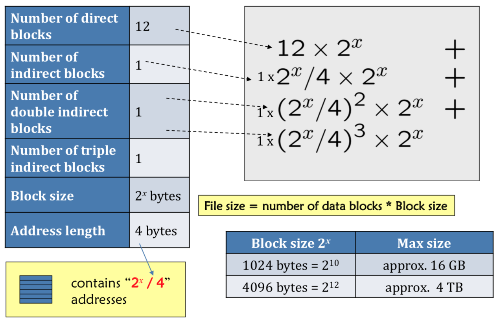
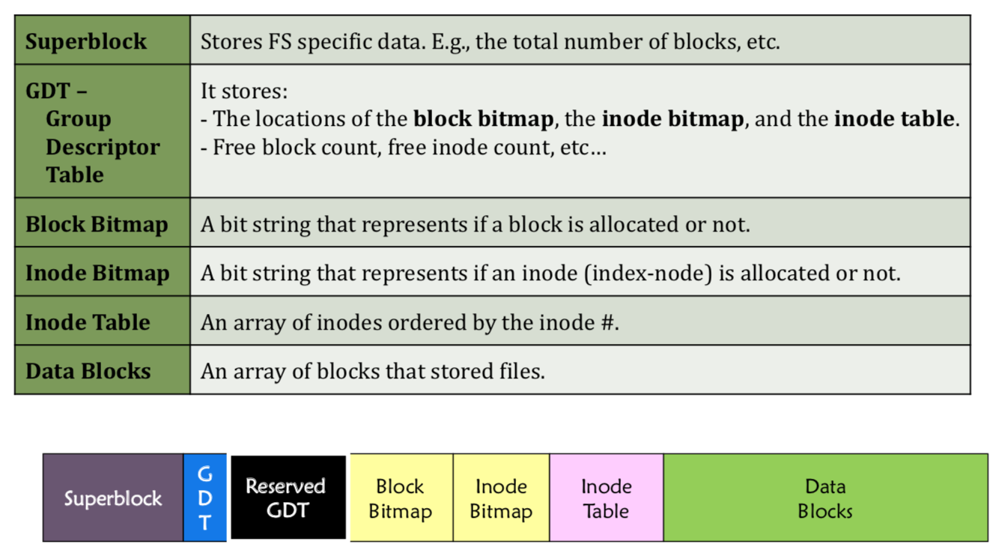

# OS Final Review

## What is an os

Special layer of software that provides application software access to hardware resources 

* Convenient abstraction of complex hardware devices 
* Protected access to shared sources  
* Security and authentication  
* Communication amongst logical entities

## OS basics

* "Virtual Machine" Boundary 
* Program => Process 
* Context Switch 
* Scheduling, Protection
* I/O
* Loading 

## Four Fundamental OS Concepts 

### Thread

* Certain registers hold the context of thread 
  * Stack pointer holds the address of the top of stack 
    *  Other conventions: Frame pointer, Heap pointer, Data 
  * May be defined by the instruction set architecture or by compiler conventions 

* Single unique execution context: fully describes program state 
  * Program Counter, Registers, Execution Flags, Stack 
* A thread is executing on a processor when it is resident in the processor registers
* PC register holds the address of executing instruction in the thread
* Registers hold the root state of the thread
  * The rest is “in memory” 

### Address space 

* The set of accessible addresses + state associated with them
  * For a 32-bit processor there are 2^32 = 4 billion addresses
* Programs execute in an address space that is distinct from the memory space of the physical machine
* When read or write to an address 
  * Perhaps nothing
  * Perhaps acts like regular memory 
  * Perhaps ignores writes
  * Perhaps causes I/O operation (Memory-mapped I/O) 
  * Perhaps causes exception (fault) 

### Process

* Execution environment with Restricted Rights 
  * An address space and one or more threads of control
  * Owns memory (address space)  
  * Owns file descriptors, file system context
  * Encapsulate one or more threads sharing process resources 
* Importance
  * Protected from each other!
  * OS Protected from them
  * Processes provides memory protection
  * Threads more efficient than processes 
* Fundamental tradeoff between protection and efficiency 
  * Communication easier within a process, harder between processes 
* Application instance consists of one or more processes 

### Dual mode operation / Protection

* Hardware provides at least two modes  
  * "Kernel" mode (or supervisor” or “protected”)
  * 􏰁"User" mode: Normal programs executed 

* Only the “system” has the ability to access certain resources 
* The OS and the hardware are protected from user programs and user programs are isolated from one another by controlling the translation from program virtual addresses to machine physical addresses 
* What is needed in the hardware to support “dual mode” operation? 
  * A bit of state (user/system mode bit) 
  * 􏰁Certain operations / actions only permitted in system/kernel mode, in user mode they fail or trap 
  * 􏰁User -> 􏰄Kernel transition sets system mode AND saves the user PC, operating system code carefully puts aside user state then performs the necessary operations 
  * 􏰁Kernel -> 􏰄User transition clears system mode AND restores appropriate user PC, return-from-interrupt
* Protection don't require hardware support for translation and dual-mode behavior 
* Protection via software fault isolation
  * Language independent approach: have compiler generate object code that provably can’t step out of bounds
  * Or use virtual machine to guarantee safe behavior (loads and stores recompiled on fly to check bounds) 

#### Kernel -> user

- Allocate and initialize address-space control block 
- Read program off disk and store in memory  
- Allocate and initialize translation table (point at code)
- Run: set register, hadware pointer to translation table, processor status word, jump to start

#### User -> kernel

* Cannot let inmate (user) get out of padded cell on own
* A system call instruction causes a synchronous exception (or “trap”) 
  * Others including
    * Divide by zero, Illegal instruction, Bus error
    * Segmentation Fault
    * Page Fault
  * Interrupts are Asynchronous Exceptions
  * Interrupts can be disabled, traps cannot! 
* On system call, exception, or interrupt 
  * Hardware enters kernel mode with interrupts disabled
  * Saves PC, then jumps to appropriate handler in kernel
* Actual handler typically saves registers, other CPU state, and switches to kernel stack

## Some concepts

### Process lifecycle

Except the first process “init”, every process is created using fork(). 

### Process Scheduling

* The procedure that decides which process to run next.
* Scheduling is an important topic in the research of the operating system.
  * Related theoretical topics are covered in computer system performance evaluation. 
*  Scheduling is required because the number of computing resource – the CPU – is limited. 
* CPU-bound Process
  * Spends most of its running time on the CPU, i.e., user-time > sys-time
  * e.g. AI course assignments
* I/O-bound process 
  * Spends most of its running time on I/O, i.e., sys-time > user-time
  * e.g. /bin/ls, networking programs. 
* Scheduling algorithms
  * An offline scheduling algorithm assumes that you know the sequence of processes that a scheduler will face, for theoretical baseline.
  * An online scheduling algorithm does not have such an assumption, for practical use.

### Context switching

* The actual switching procedure, from one process to another
* One address maps to one byte.
* On a 32-bit system, the maximum amount of memory in a process is 2^32 bytes = 4GB. A 64-bit system? = 16EB 
* Kernel switch between processes
  * Same saving/restoring of registers as before  
  * Save/restore PSL

### System call

* On entry to kernel, sets system to kernel mode, handler address fetched from table/Handler started
* System call argument passing
  * In registers
  * Write into user memory, kernel copies into kernel memory
  * Every argument must be explicitly checked

## Address translation

### Virtualizing Resources 

* Physical Reality: different processes/threads share the same hardware
* The complete working state of a process is defined by its data in memory (and registers) 
* Consequently, two different processes cannot use the same memory, two different data cannot occupy same locations in memory 
* May not want different threads to have access to each other’s memory 

### Single and Multithreaded Processes 

* Threads encapsulate concurrency, "Active" component of a process
* Address spaces encapsulate protection
  * Keeps buggy program from trashing the system
  * "Passive" component of a process 

### Memory Multiplexing 

* **Protection**: prevent access to private memory of other processes 
  - Kernel data protected from User programs 
  - Programs protected from themselves 
  - May want to give special behavior to different memory regions (Read Only, Invisible to user programs, etc)
* **Controlled overlap**: sometimes we want to share memory across processes. 
  * E.g., communication across processes, share code
  * Need to control such overlap
* **Translation**
  * Translate accesses from one address space (virtual) to a different one (physical) 
  * Processor uses virtual addresses, physical memory uses physical addresses 
  * Side effects
    * give uniform view of memory to programs
    * provide protection (e.g., avoid overlap)  
    * control overlap 

### Multi-step Processing of a Program for Execution 

* Addresses can be bound to final values anywhere in this path 
* Dynamic Libraries linking postponed until execution, small piece of code, **stub**, used to locate appropriate memory-resident library routine, replaces itself with the address.

### Uniprogramming

* Application always runs at same place in physical memory since only one application at a time
* Application can access any physical address
* Application given illusion of dedicated machine by giving it reality of a dedicated machine 

### Multiprogramming 

* Multiprogramming without Translation or Protection 
  * Must somehow prevent address overlap between threads
  * Use Loader/Linker: Adjust addresses while program loaded into memory (loads, stores, jumps)
    * Everything adjusted to memory location of program 
    * Translation done by a linker-loader
* Multiprogramming with Protection
  * Use two special registers BaseAddr and LimitAddr to prevent user from straying outside designated area 
  * During switch, kernel loads new base/limit from PCB  (Process Control Block)

### General Address translation

* Step 1. When CPU wants to fetch an instruction, the virtual address is sent to MMU and is translated into a physical address. 
* Step 2. The memory returns the instruction 
* Step 3. The CPU decodes the instruction (virtual)
* Step 4. With the help of the MMU, the target memory is retrieved
* Translation makes it much easier to implement protection  
* Base and Bounds
  * Alter address of every load/store by adding “base” 
  * Generate error if address bigger than limit 
  * Gives program the illusion that it is running on its own dedicated machine, with memory starting at 0 

* Base and bound issues
  * Fragmentation problem over time (not same size)
  * Missing support for sparse address space
  * Hard to do inter-process sharing

### Flexible Segmentation

- Logical View: multiple separate segments (Code, Data, Stack , memory sharing)
- Each segment is given region of contiguous memory, has a base and limit  

* Multi-Segment Model 

  

* Observation

  * Virtual address space has holes
  * Stack and heap are allowed to grow outside valid range 
  * Code segment: read-only; data and stack: read-write; shared segment: read-only or read-write
  * Segment table stored in CPU, store all of processes memory onto disk when switched

* Problems 

  * Must fit variable-sized chunks into physical memory 
  * Move processes multiple times 
  * Limited options for swapping to disk
  * Fragmentation: wasted space (external, internal) 

### Paging

* Allocate physical memory in fixed size chunks (“pages”) 

* Page table pointer and limit needs to be switched on a context switch
* Two-Level Paging 

## Cache

### Translation 

* Page Table Entry (PTE)
  - Pointer to next-level page table or to actual page
  - Permission bits: valid, read-only, read-write, write-only 
* Inside MMU
  * Hardware Tree Traversal
    * Generates a “Page Fault” if it encounters invalid PTE
    * Relatively fast, but inflexible
  * Software
    * Very flexible, but every translation must invoke fault

### Caching Concept

* A repository for copies that can be accessed more quickly than the original
* Only good if frequent case frequent enough and infrequent case not too expensive 
* Average Access time =  (Hit Rate x Hit Time) + (Miss Rate x Miss Time)  = Hit Time + Miss Rate x Miss Penalty 
* Translation Cache: TLB ("Translation Lookaside Buffer") , a memory cache that is used to reduce the time taken to access a user memory location.
* Locality
  * Temporal Locality: keep recently accessed data items closer to processor 
  * Spatial Locality: Move contiguous blocks to the upper levels 
* Memory Hierarchy: register, onchip cache, Second level cache (SRAM), Main memory (DRAM), Secondary Storage (disk)
* Sources of Cache Misses
  * Compulsory: first access a block
  * Capacity
  * Conflict
  * Coherence: other process updates memory (invalid)

* TLB Miss: Processor receives TLB fault, if PTE valid, fills TLB and returns from fault; if PTE marked as invalid, internally calls Page Fault handler 
* Cache Organizations
  * Direct Mapped: single block per set 
  * Set associative: more than one block per set
  * Fully associative:all entries equivalent

### Mapped cache

e.g. Block 12 placed in 8 block cache 

#### Direct mapped cache

* The uppermost (32 - N) bits are always the Cache Tag 
* The lowest M bits are the Byte Select (Block Size = 2M)
* block 12 can go only into block 4 (12 mod 8) 

#### Set Associative cache

* N direct mapped caches operates in parallel 
* block 12 can go anywhere in set 0 (12 mod 4) 

#### Fully Associative Cache 

* Every block can hold any line 
* Address does not include a cache index  
* Compare Cache Tags of all Cache Entries in Parallel
* block 12 can go anywhere 

#### Write

* Write through: The information is written to both the block in the cache and to the block in the lower-level memory 
  * PRO: read misses cannot result in writes 
  * CON: Processor held up on writes unless writes buffered 
* Write back: The information is written only to the block in the cache
  * PRO: repeated writes not sent to DRAM processor not held up on writes 
  * CON: More complex read miss may require write back of dirty data 

## Demand paging

* Use main memory as cache for disk 
* In-use virtual memory can be bigger than physical memory 
* Principle: Transparent Level of Indirection  
  * Supports flexible placement of physical data 
  * Variable location of data transparent to user 
* Block size: 1 page; fully associative; find a page: first check TLB, then page-table traversal; miss: go to lower level; write-back.

### Mechanisms

* Valid: Page in memory, PTE points at physical page 
* Not Valid: Page not in memory; use info in PTE to find it on disk when necessary 
* Where does OS get a free frame ?
  * Keeps a free list
  * Unix runs a “reaper” if memory gets too full  
  * Evict a dirty page  
* Deal page fault
  * Choose an old page to replace
  * If old page modified (“D=1”), write contents back to disk
  * Change its PTE and any cached TLB to be invalid
  * Load new page into memory from disk
  * Update page table entry, invalidate TLB for new entry
  * Continue thread from original faulting location
* Effective Access Time = Memory access time + Average page-fault service time  * rate
* Misses: Compulsory, Capacity, Conflict, Policy (replacement)

### Replacement policies

* FIFO
* Min: will not be used for the longest time 
* RANDOM  
* LRU: not been used for the longest time 
* Clock: replace an old page, not the oldest page
  * clock hand 1/0, can be n/0
* Second chance: FIFO + LRU

### Some concept

* TLB and use bit 
  * Hardware sets use bit in TLB; when TLB entry is replaced, software copies use bit back to page table 
  * Software manages TLB entries as FIFO list; everything not in TLB is Second-Chance list, managed as strict LRU 
* Core Map: virtual page -> physical page 
  *  reverse mapping is needed
* Allocation
  * Each process needs minimum number of pages
  * Replacement scopes
    * Global: one process can take a frame from another 
    * Local: each process selects from only its own set 
  * Methods
    * Fixed Scheme: equal & proportional 
    * Priority Allocation  
* Working-Set Model
  * Thrashing: a process is busy swapping pages in and out
  * Program Memory Access Patterns have temporal and spatial locality
  * Working Set: Group of Pages accessed along a given time slice, defines minimum number of pages needed for process to behave well
  * WSi (working set of Process Pi) = total set of pages referenced in the most recent ∆ (varies in time) 
  * D = ∑|WSi| = total demand frames 

## I/O

### Operational Parameters 

* Data granularity
  * Byte: keyboard
  * Blocks: disks, networks
* Access pattern
  * Sequential: tape
  * Random: disk, cd
* Transfer Mechanism 
  * Programmed IO
  * DMA
* I/O Subsystem: is responsible to provide scheduling, buffering, caching, reservation, error handling

### Access pattern (Interfaces) 

* Block Devices (disk drives, tape drives, DVD-ROM)
  * Access blocks of data
  * Commands include open(), read(), write(), seek()
  * Raw I/O or file-system access 
  * Memory-mapped file access possible
* Character Devices: keyboards, mice
  * Single characters at atime
  *  Commands include get(), put() 
  * Libraries layered on top allow line editing 
* Network Devices: e.g. Ethernet, Wireless, Bluetooth
  * Different enough from block/character to have own interface 

### Access timing

* Blocking Interface: “Wait” 
  * When request / write data (e.g. read() system call), put process to sleep until data / device is ready
* Non-blocking Interface: “Don’t Wait”
  * Returns quickly from read or write request with count of bytes successfully transferred 
* Asynchronous Interface: “Tell Me Later”
  * When request / send data, take pointer to user’s buffer, return immediately; later kernel fills buffer and notifies user 

### Transferring Data To/From Controller

* CPU interacts with a Controller 
* Programmed I/O
  * Each byte transferred via processor in/out or load/store 
  * Pro: Simple hardware, easy to program
  * Con: Consumes processor cycles proportional to data size 
* Memory mapped I/O
  * Give controller access to memory bus 
  * Ask it to transfer data blocks to/from memory directly

### I/O Device Notifying the OS 

* I/O Interrupt:
  * Device generates an interrupt whenever it needs service
  * Pro: handles unpredictable events well
  * Con: interrupts relatively high overhead 
* Polling: 
  * OS periodically checks a device-specific status register  I/O device puts completion information in status register 
  * Pro: low overhead 
  * Con: may waste many cycles on polling if infrequent or unpredictable I/O operations

### I/O Performance Concepts 

* Response Time or Latency: Time to perform an operation(s) 
* Bandwidth or Throughput: Rate at which operations are performed (op/s) 
  * Files: MB/s, Networks: Mb/s, Arithmetic: GFLOP/s
* Start up or “Overhead”: time to initiate an operation
* Transfer capacity B, startup cost(Overhead) S, n bytes 
  * Latency(n) = S + n/B
  * Bandwidth = n/(S + n/B) = B * n/( B * S + n) = B/(B * S/n + 1) 
  * half-power point occurs at n=S * B 
* Magnetic disks: slow performance for random access, better performance for sequential access
* Flash memory: good performance for reads; worse for random writes
* Costs
  - Syscall overhead
  - Operating system processing 
  - Controller Overhead 
  - Device Startup 
  - Queuing

### Magnetic Disk 

* Sector: unit of transfer, ring of sectors form a track, stack of tracks form a cylinder, heads position on cylinders 
* Cylinders: all the tracks under the head at a given point on all surface
* Vectors [cylinder, surface, sector] 
* Disk Latency = Queueing Time + Controller time + Seek Time + Rotation Time + Transfer Time 
  * Seek time: position the head/arm over the proper track
  * Rotational latency: wait for desired sector to rotate under r/w head
    * Contributing factors: software paths, hardware controller, I/O device service time 
  * Transfer time: transfer a block of bits (sector) under r/w head

## Storage, Performance 

### SSD summary

* Pros (vs. hard disk drives): 
  * Low latency, high throughput (eliminate seek/rotational delay)
  * No moving parts: very light weight, low power, silent, very shock insensitive 
  * Read at memory speeds (limited by controller and I/O)
* Cons
  * Small storage, expensive 
  * Asymmetric block write performance: read pg/erase/write pg
  * Limited drive lifetime

### I/O service time

* Service rate (μ = 1/Ts) - operations per sec  
* Arrival rate: (λ = 1/Ta) - requests per second
* Utilization: U = λ/μ , where λ < μ

### Little’s Law 

* Stable system: Average arrival rate = Average departure rate 
* The average number of jobs/tasks in the system (N) is equal to arrival time / throughput (λ) times the response time (L) 
  * N(jobs)=λ(jobs/s) x L(s)
* Average occupancy (Navg) = S/T = (L(1) + ... + L(k))/T  =  (Ntotal/T) *(L(1) + ... + L(k)) / Ntotal = λavg × Lavg 
* Avg response time for disk request = Tsys = Tq + Tser = Tser*(u/1-u + 1)

### Disk Scheduling

* FIFO Order
* SSTF: Shortest seek time first 
  * Pick the request that’s closest on the disk 
  * Con: may lead to starvation
* SCAN: take the closest request in the direction of travel
* C-SCAN: Circular-Scan: only goes in one direction

## File system

### Concepts

* File system: layer of OS that transforms block interface of disks (or other block devices) into files and directories, is a way that lays out how data is organized on a storage device
* Transforms blocks into Files and Directories  
* Optimize for access and usage patterns
* Maximize sequential access, allow efficient random access 
* Components: naming, disk management, protection, reliability / durability
* Different views
  * User: Durable Data Structures 
  * System (system call interface): Collection of Bytes 
  * System (inside OS): Collection of blocks (logical transfer unit)
* Reads bytes
  * Fetch block corresponding to those bytes
  * Return just the correct portion of the block
* Write bytes
  * Fetch block 
  * Modify portion
  * Write out Block 
* Everything inside File System is in whole size blocks

### Disk Management Policies

* File: user-visible group of blocks arranged sequentially in 

  logical space 

* Directory: user-visible index mapping names to files

* Access disk as linear array of sectors

  * Logical Block Addressing (LBA): Every sector has integer address from zero up to max number of sectors 
  * Controller translates from address -> physical position 
    * First case: OS/BIOS must deal with bad sectors
    * Second case: hardware shields OS from structure of disk 

* File Header: optimize placement of files’ disk blocks to match access and usage patterns

### Contiguous allocation 

* Root directory: store filename, starting address and size, and all the attributes
* File locate is easy
* File deletion is easy
* File creation is bad: external fragmentation
  * Must defragmentation  

### Linked allocation 

* Steps
  * Chop the storage device into equal-sized blocks
  * Fill the empty space in a block-by-block manner
* Leave 4 bytes from each block as the "pointer", to the next block or -1
* Internal Fragmentation: last block of a file may not be fully filled
* Poor random access performance

### File Allocation Table (FAT)

* Centralize all the block links, linked list with blocks
* Read file steps
  * Read the root directory and retrieve the first block number
  * Read the FAT to determine the location of next block (may not be contiguously allocated)
  * Stops until the FAT says the next block # is -1
* FAT 12: 12bits cluster address length; FAT 16: 16bits; FAT 32: 28bits (reserve 4)
* File system size = block size * block address

### FAT series 

#### Layout overview

* Boot sector: FS-specific parameters
* FSINFO: free-space management 
* FAT: 2 pieces, 1 copy as backup 
* Root directory: start of the directory tree

#### Directory entry 

* Big endian: Significant (big) byte goes first 
* Little endian: Insignificant (little) byte goes first
* Largest file: 4G - 1 bytes

#### LFN directory entry 

#### Reading file

1. Read the content from Cluster #32. Note. The file size may also help determining if the last cluster is reached. 
2. Look for the next cluster and it is Cluster #33.
3. Since the FAT has marked “EOF”, we have reached the last cluster of that file. 

#### Writing file

1. Locate the last cluster.  
2. Start writing to the non-full cluster
3. Allocate the next cluster through FSINFO 
4. Update the FATs and FSINFO 
5. When write finishes, update the file size

#### Delete file

1. De-allocate all the blocks involved. Update FSINFO and FATs
2. Change the first byte of the directory entry to _ (0xE5) 

### Design file system

* Durable data store 
* Disks Performance 
* Open before Read/Write  
* Size is determined as they are used  
* Organized into directories
* Need to allocate / free blocks

#### Components 

* File path -> directory structure -> file number (inumber) -> file index structure (inode) -> data blocks

* File name offset -> (directory offset) -> file number -> (index structure) -> storage block 

* Open performs Name Resolution 
  * Translates pathname into a “file number”
  * Creates a file descriptor in PCB within kernel
  * Returns a “handle” (another integer) to user process
* Directory
  * hierarchical structure 
  * each has a name and attributes
  * Links (hard links) make it a DAG
* File
  * Data
  * Metadata (Attributes)
  * Owner, size, last opened
  * Access rights
    * R, W, X
    * Owner, Group, Other

#### FAT Properties 

* File is collection of disk blocks
* File Number is index of root of block list for the file 
* Grow file by allocating free blocks and linking them in 
* FAT stored on disk, on boot cache in memory, second backup on disk
* Format the disk: zero the block, link up the FAT free list
* File attributes are kept in directory
* resolve "/my/book/count"
  * Read in file header for root (fixed spot on disk)
  * Read in first data block for root
  * Read in file header for “my”
  * Read in first data block for “my”; search for “book”
  * Read in file header for “book”
  * Read in first data block for “book”; search for “count”
  * Read in file header for “count” 
* Security holes
  * FAT has no access rights 
  * FAT has no header in the file blocks 

### iNode allocation

* All pointers of a file are located together
* One directory/file has one Inode
* Pointers are unbalanced tree-based 
* File megadata: 9 basic access control bits: UGO x RWX
* Direct pointers: 4kB blocks -> sufficient for files up to 48KB
* Indirect pointers 
  * point to a disk block 
  * containing only pointers - 4 kB blocks => 1024 ptrs => 4 MB @ level 2 => 4 GB @ level 3 => 4 TB @ level 4
* Max file size != FS size

### Ext2/3

* Block size: 1,024, 2,048, or 4,096 bytes
* The file system is divided into block groups and every block group has the same structure 

#### Disk layout

* Number of files in the file system is fixed
* Pros
  * Performance: spatial locality.  
  * Reliability: superblock and GDT are replicated in each block group 

#### Directory

* Directory entry in directory block
  * 0-3 Inode number of that file/directory 
  * 4-5 Length of this entry 
  * 6-6 Length of the filename 
  * 7-7 File Type 
  * 8+ Name in ASCII (max 255 character) 

#### Link file

* Hard link
  * A directory entry pointing to the inode of an existing file
  * File can accessed through two different pathnames
  * Root directory: “.” and “..” pointing to itself
  * Remove the original still accessible through
* Symbolic link
  * Creates a new inode
  * Target’s pathname are stored using the space originally designed for 12 direct block and the 3 indirect block pointers
  * Remove the original, pathname can not access

### NTFS

* Variable length extents
* Everything (almost) is a sequence of \<attribute:value\> pairs
* Mix direct and indirect freely
* Directories organized in B-tree structure by default
* Master File Table
  * Database with Flexible 1KB entries for metadata/data 
  * Variable-sized attribute records (data or metadata)
  * Extend with variable depth tree (non-resident) 
* Extents – variable length contiguous regions
* Journaling for reliability