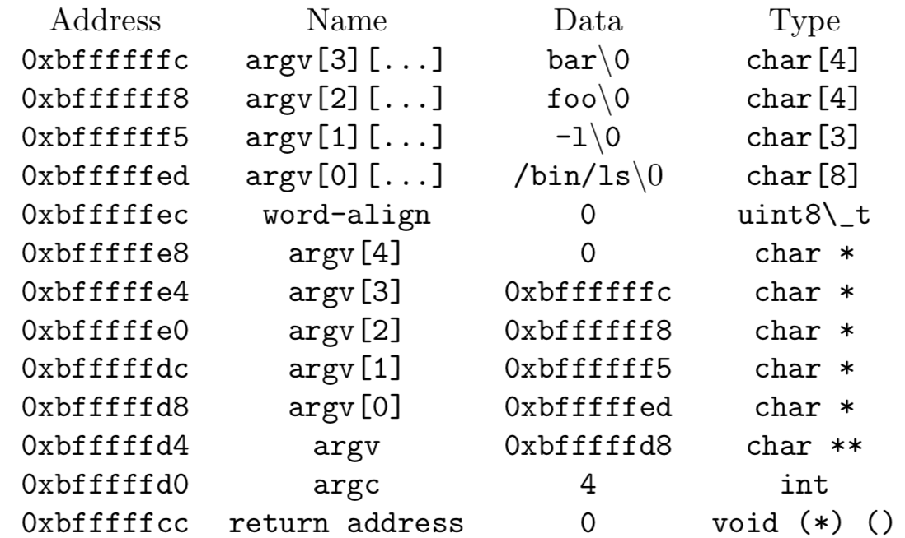
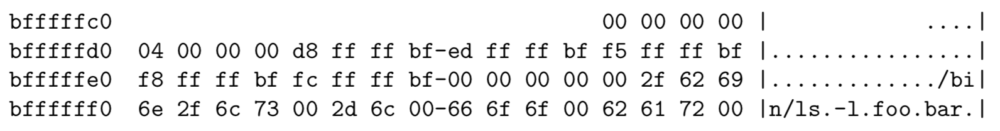
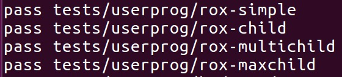
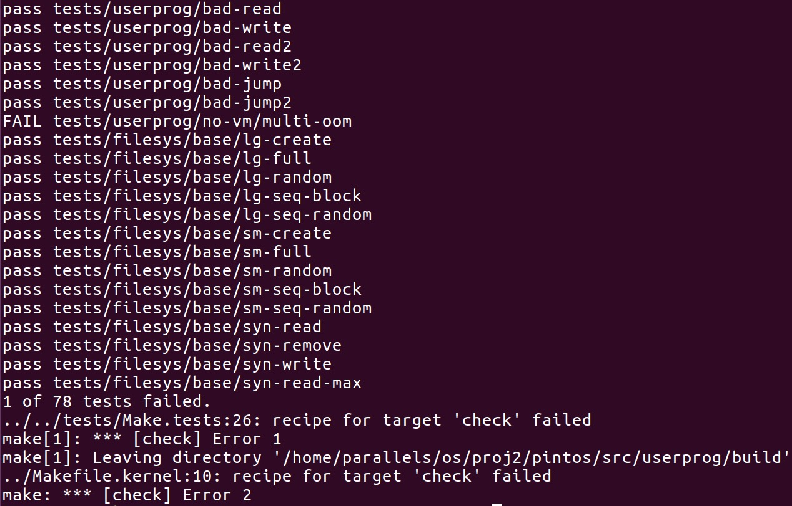

# OS Project 2 : User Program

* Jie Lin <11510537@mail.sustc.edu.cn>
* Yuxing Hu <11510225@mail.sustc.edu.cn>

---

## Preliminary

### Introduction

In the Pintos user program project we need to extend Pintos's support for user programs. This project aims for us to implement the necessary features for user programs (the test programs) to request kernel functionality. Up to now, all of the code we have run under Pintos has been part of the operating system kernel. This means, for example, that all the test code from the last assignment ran as part of the kernel, with full access to privileged parts of the system. Once we start running user programs on top of the operating system, this is no longer true. This project deals with the consequences.

### Prerequisites

#### Set up directory

We need to re-copy & paste the pintos-base repository contents into a new
directory named proj2, or copy / paste our proj1 directory and rename it proj2. However, in the end, we decides to use the pintos_origin that the teaching assistants gave us and all the updated changes are implement by it.

#### Keep alarm implementation

After carefully skim all the tasks of project 2, we notice that the default time scheduling algorithm should be basic round-robin, which is also the default setting of project 1. We do not need priority donation implementation, but just the alarm. And after that, we should pass and we actually did passed all the alarm tests in src/threads except alarm-priority.

#### Modify the system files

The TA modifies the Maketest file and add two test that did not exist tests, so the first thing we've done is about erasing the useless test. On the other hand, excluing modifing the path of Bochs, we also change the utils/gdb-pintos's makefile, more specificly, changing the path from direct to relative.

### Dependencies

The whole project is deployed and tested under the Ubuntu 16.04 version Linux OS. The majority of codes are written within vim, whereas the others are used sublime text to type in. For debugging, we choose gdb as the testing instrument. We use git to control the version and github to communicate between each other.

## Task 1: Argument passing

### Data structures and functions

In timer.c,

```c
void timer_sleep(int64_t ticks) 
```

By change timer_sleep() function we are able to check whether the tick is acceptance and assert the level value to INTR_ON to check whether there's an mistake. On the other hand, we need to get the awake_time value so that the thread can be waken up when it comes to it's turn.

In thread.c,
```c
static struct list sleep_list;

list_init(&sleep_list);

void thread_sleep(int64_t time_to_awake) 

void thread_awake(int64_t current_time)
```

In thread.c, we create a sleep_list so that we are able to check and control all the thread that is sleeping or unused. The thread_sleep() function create an old_level enum so that when time comes to awake thread it's possible to call and wake them. thread_awake() function is used for awaking thread by go through the sleep_list and find whether there's one thread's awake time is fewer than current time and then to awake them.

In thread.h,
```c
int64_t awake_time; 

struct list_elem sleepelem;
```

Create a new int to indicating the remaining time to awake, and also create a elem list to store the sleeping thread.

In process.h,

```c
typedef int pid_t;
```

Define the pid of thread.

### Algorithm and Methods

In progress.c,

```c
tid_t process_execute(const char *file_name) {
    char *save_ptr;
    file_name = strtok_r(file_name, " ", &save_ptr);
}

static void start_process(void *file_name_) {
    char *save_ptr;
    input = palloc_get_page(0);
    strlcpy(input, file_name, PGSIZE);
}

static bool setup_stack(void **esp, int argc, char *argv[]); 
```

There are several changing here in order to get the program run. We change the sturction of process_execute in order to save the file name and the execution parameters. We also add the pointer save_ptr into the start progcess and check the input to the file_name to get things right. The setup_stack is not setup, so we change it and right now it can accept the inputs.

The most important part was to setup the stack. We did it inside setup_stack() after page is installed, when the stack has been initialized.

Process_execute provides file_name, including command and arguments string. First, we separated the first token and the rest, which are command and arguments. We use command as the new thread's name, and pass down the arguments string to start_process(), load() and setup_stack(). We think it’s implementable since we can always get the command name from thread->name when needed, like when load the ELF executable. 

When setting up the stack, we memcpy the argument string and then the command name which is actually the thread name in our case. Then add alignment, scan the string backward to get each token and push its address into the page underneath the alignment to generate argv[], finally argv, argc and return address.

We scan through the argument string backwards, so that the first token we get is the last argument, the last token we get is the first argument. We can just keep decreasing esp pointer to setup the argv[] elements. 

The thing is we decided not to check the esp pointer until it fails. Our implementation didn’t pre-count how much space do we need, just go through everything, make the change, like add another argv element, when necessary. But this leaves us two way to deal with overflowing, one is checking esp’s validity every time before use it, the other one is letting it fails, and we handle it in the page fault exception, which is exit(-1) the running thread whenever the address is invalid. We chose the latter approach since the first approach seems have too much burden and it make sense to terminate the process if it provides too much arguments.


### Synchronization



In this example, the stack pointer would be initialized to 0xbfffffcc. As shown above, our code start the stack at the very top of the user virtual address space, in the page just below virtual address PHYS_BASE (defined in threads/vaddr.h).

We find the non-standard hex_dump() function, declared in <stdio.h>, useful for debugging your argument passing code. And it should shown as:



The step of our movement is :

1. Parse the argument by white spaces
2. Write each argument (including \0) in reverse
3. Word align to 4 bytes, write the word align
4. Write four 0’s as last argument
5. Write the addresses of each argument
6. Write the address of argv
7. Write argc
8. Write a 0 for the return address

After all these, we double check our setup stack is correct with hex_dump.

### Rational

The only difference between strtok_r() and strtok() is that the save_ptr (placeholder) in strtok_r() is provided by the caller. In pintos, the kernel separates commands into command line (executable name) and arguments. So we need to put the address of the arguments somewhere we can reach later.

One reason is that there is no reason to do that in kernel mode when it can be done in user mode. If something goes wrong, like if there are too many arguments, and the parser crashes, only the shell will experience it and the kernel stays safe. 

Another reason would be features such as redirection and path variables. This, again, would add complexity to the kernel code, since the kernel would then have to go digging around to find the user-level resources.

## Task 2: Process control syscalls

### Data structures and functions

In syscall.c,
```c
static int get_user(const uint8_t *uaddr) {
  if(uaddr >= PHYS_BASE){
    syscall_exit(-1);
   }  
}
```

Add the condition that may cause failre: the user address is bigger than physical basement.

In exception.c,

```c
static void page_fault(struct intr_frame *f) {
  if (!user) {
    f->eip = (void *)f->eax;
    f->eax = 0xffffffff;
    return;
  }
```

Another method to check the existance of user.

In syscall.c,

```c
static bool put_user(uint8_t *udst, uint8_t byte) {
  if (!is_user_vaddr(udst)) {
    return false;
  }
}

static bool is_invalid(uint8_t *uaddr, size_t size) {}

static void syscall_handler(struct intr_frame *f) {}
```

This bool instance is used to check whether we can put user into the method, which means to check the validation of user.

However at this stage we change the construction of syscall_handler method so right now we can deal with different system calls including system halt, exit, execute, wait, create, open, check file size, read, write, seek, tell and close differential by switch. Although only some of them are used in this task, all of them need to be implemented carefully if we want to pass all the test.

In thread.c,
```c
static void init_thread{
    #ifdef USERPROG
  list_init(&t->file_descriptors);
  t->fd_num_to_assign = 2;
#endif
}
```

This structure is special designed for user program task, to initialize a thread and add them into the list in order to execute them one by one.


### Algorithm and Methods

To finish part 2 of this project, we needs to implement some basic system call so that we can finish all the task that process control can work.


To execute the syscall_halt, we simply insert the shutdown_power_off inside of it. It is easy because it is not a safe way to shut down the system, infomation may loss.

```c
void syscall_halt() { 
    shutdown_power_off(); 
}
```

The exit method is also simple, we need to create a pointer to locate the current thread and a child thread pointer to locate all the child thread the current thread create. We might also need to sema_ip the child thread if the parent is waiting for the child thread to execute.

```c
for (e = list_begin(&cur->parent->children);
       e != list_end(&cur->parent->children); e = list_next(e)) {
    struct child_thread *t = list_entry(e, struct child_thread, child_elem);
    if (cur->tid == t->tid) {
      child = t;
      child->exit_status = status;
      child->exited = true;
      if (cur->parent->waiting_for == cur->tid) {
        sema_up(&child->child_exit);
      }
      break;
    }
  }
```

The execute method for syscall is pretty simple, we just accept the input line from outsider and acquire a lock for file system then start to execute it. This line is for future use from file exections. It starts a new thread running a user program loaded from filename. The new thread may be scheduled (and may even exit) before process_execute() returns.  Returns the new process's thread id, or TID_ERROR if the thread cannot be created.

```c
pid_t syscall_exec(const char *cmd_line) {
  pid_t ret;
  acquire_filesys_lock();
  ret = process_execute(cmd_line);
  release_filesys_lock();
  return ret;
}
```

Waiting function here is about to call the process wait function we previously created and wait for them it. This method is created in process.c, it will go through the child list until each one of the children is finished. And delete that child's pid after sema_down that child.

```c
for (e = list_begin(&cur->children); e != list_end(&cur->children);
       e = list_next(e)) {
    struct child_thread *t = list_entry(e, struct child_thread, child_elem);
    if (child_tid == t->tid) {
      child = t;
      break;
    }
  }
  if (child == NULL) {
    return -1;
  }
  cur->waiting_for = child_tid;
  if (!child->exited) {
    sema_down(&child->child_exit);
  }
  remove_child_by_tid(child_tid);
  int ret = child->exit_status;
```

In the init.c, we found that the testing code is implemented by checking it is operated by userprog first or not. So we implement wait-syscall in term of process_wait.

We define a new struct child_status to represent child’s exit status. And a list of child_status is added into parent’s thread struct, representing all children the parent owns. We also introduce a parent_id inside child’s struct, to ensure child can find parent and set it’s status if parent still exists. 

A child_status is created and added to list whenever a child is created, then parent will wait(cond_wait) if child has not already exited, child is responsible to set it’s return status and wake up parent. 

We have a monitor in parent’s struct to avoid race condition. Before checking or setting the status, Parent and Child both should acquire the monitor first.

If parent is signaled or sees the child has exited (checking using the function we wrote thread_get_by_id ), it will start to check the status. 

If child calls exit-syscall to exit, a boolean signal that indicate exit-syscall is called and the child’s exit status will be set into the corresponding child_status struct in parent’s children list. 

If child is terminated by kernel, the boolean signal mentioned above is remain as false, which will be seen by parent, and understood child is terminated by kernel.

If parent terminates early, the list and all the structs in it will be free, then the child will find out the parent already exited and give up setting the status, continue to execute. 

### Synchronization

We created a struct that stores the success/fail of load(). This value is updated whenever start_process() calls load() so load's status should be always available. We didn't want to change start_process() to a bool instead of void because we weren't sure if this would affect the code every where else.

Our design is to have the child_load_status recorded in the parent’s thread. Child is responsible to set child_load_status. Child can get the parent thread through a new field parent_id and the function we provide (thread_get_by_id) to get the parent thread’s access. 

The reason we choose this design is that the child thread can exit anytime due to some odd reason. So, if we save it in the child process, there is no way to retrieve the status if it exits before the parent checking on it. A thread can only wait a thread to load at a time, so use only one variable inside the parent thread is enough. 

We also introduce a monitor. When child’s load success/failure, the child will get the parent thread by it’s id, acquire the monitor to set the the value inside parent’s thread, signal the parent. When child is exit accidentally, it will set up the value to fail either. Before the parent create the child thread, the parent will set up child_load_status to 0, which is initial value means nothing happens so far. After thread is created, the parent acquire the monitor to wait until child_load_status is not 0. 

### Rational

Looking at the project documentation's options for accessing user memory, we picked the method that verifies the validity of a user-provided pointer, then dereference it. Because it's simpler to implement than the other one.

There is no need to change this mapping because Pintos does not support multithreading.

If multithreading was required, we could do something like pid * 1000 + tid, so we could easily determine the thread's process.

## File operation syscalls

### Data structures and functions

In thread.h,

```c
struct list file_descriptors;
int fd_num_to_assign;

struct thread *parent;

struct child_thread {
    int tid;
    struct list_elem child_elem;
    int exit_status;
    bool exited;
    struct semaphore child_exit;
};
```

A struct to assign more infos into the file lists, and the int is used to label the assigned task.

In process.h,
```c
struct file_descriptor {
  int fd_num;
  struct file *fd_file;
  struct list_elem fd_elem;
};
```

The file structure for the future needs.

In syscall.c,
```c
int syscall_filesize(int fd_num){}

int syscall_write(int fd, const void *buffer, unsigned size){}

pid_t syscall_exec(const char *cmd_line) {}

bool syscall_create(const char *file, unsigned initial_size) {}

bool syscall_remove(const char *file) {}

int syscall_open(const char *file) {}

void syscall_seek(int fd_num, unsigned position) {}

unsigned syscall_tell(int fd_num) {}

void syscall_close(int fd_num) {}

int syscall_read(int fd_num, void *buffer, unsigned size) {}
```

These are the methods to implement the file system functions.

### Algorithm and Methods

All the algorithm here is to build a solid file execution system. 

Create function can create a file after requiring lock with the parameter name of file and initial_size of the file. Pretty simple and no trap here.

```c
bool syscall_create(const char *file, unsigned initial_size) {
  bool ret;

  acquire_filesys_lock();
  ret = filesys_create(file, initial_size);
  release_filesys_lock();

  return ret;
}
```

Remove function is just like create, but it transfer another built in function called filesys_remove.

```c
bool syscall_remove(const char *file) {
  bool ret;

  acquire_filesys_lock();
  ret = filesys_remove(file);
  release_filesys_lock();

  return ret;
}
```

Open function will first create a file_descriptor and malloc for its space.
However if there's no space, the the file will not open. After acquiring the lock of cuntion, it transfer built in open function and check the existance of it. At last, it push descriptor into the list.

```c
struct thread *cur = thread_current();
  struct file_descriptor *fd = malloc(sizeof(struct file_descriptor));
  if (fd == NULL) {
    return -1;
  }

  acquire_filesys_lock();
  fd->fd_file = filesys_open(file);
  if (fd->fd_file == NULL) {
    release_filesys_lock();
    return -1;
  }
  fd->fd_num = cur->fd_num_to_assign++;
  list_push_back(&cur->file_descriptors, &fd->fd_elem);
  release_filesys_lock();

  return fd->fd_num;
```

The setting of filesize irequire us to find the correct file in file descriptor list and then entry to it and recent the file length to it.

```c
 acquire_filesys_lock();
  for (e = list_begin(file_descriptors); e != list_end(file_descriptors);
       e = list_next(file_descriptors)) {
    // get the file_descriptor in file_descriptors
    fd = list_entry(e, struct file_descriptor, fd_elem);

    if (fd_num == fd->fd_num) {
      ret = file_length(fd->fd_file);
      break;
    }
  }
  release_filesys_lock();
```

Read and write is very similar to each other. In read operation, first, check if the buffer and buffer + size are both valid pointers, if not, exit(-1). Acquire the fs_lock (file system lock). After the current thread becomes the lock holder, check if fd is in the two special cases. If it is standard out, then it is standard output, so release the lock and return -1. If fd is standard in, then retrieve keys from standard input. After that, release the lock and return 0. Otherwise, find the open file according to fd number from the open_files list. Then use file_read in filesys to read the file, get status. Release the lock and return the status.

```c
if (0 == fd_num) {
    ret = input_getc();
  } else {
    struct list_elem *e;
    acquire_filesys_lock();
    for (e = list_begin(file_descriptors); e != list_end(file_descriptors);
         e = list_next(file_descriptors)) {
      fd = list_entry(e, struct file_descriptor, fd_elem);

      if (fd_num == fd->fd_num) {
        ret = file_read(fd->fd_file, buffer, size);
        break;
      }
    }
    release_filesys_lock();
  }
```

Similar with read system call, to do the write operation, first we need to make sure the given buffer
pointer is valid. Acquire the fs_lock. When the given fd is standard out, then release the lock and return -1. When fd is standard in, then use putbuf to print the content of buffer to the console. Other than these two cases, find the open file through fd number. Use file_write to write buffer to the file and get the status. Release the lock and return the status.

```c
for (e = list_begin(file_descriptors); e != list_end(file_descriptors);
         e = list_next(file_descriptors)) {
      // get the file_descriptor in file_descriptors
      fd = list_entry(e, struct file_descriptor, fd_elem);

      if (fd_num == fd->fd_num) {
        break;
      }
    }
    if(fd!=NULL){
      acquire_filesys_lock();
    ret = file_write(fd->fd_file, buffer, size);
    release_filesys_lock();
```

Function seek need to change the current position pointer of current file, and tell is seek opeation without changing but just telling the current position. The procedure is almost the same: first acquire the lock, then go through the file system to find the right file, then use the in built call.

```c
for (e = list_begin(file_descriptors); e != list_end(file_descriptors);
       e = list_next(file_descriptors)) {
    fd = list_entry(e, struct file_descriptor, fd_elem);

    if (fd_num == fd->fd_num) {
      file_seek(fd->fd_file, position);
      // file_tell(fd->fd_file, position);
      break;
    }
  }
  release_filesys_lock();
```

### Synchronization

In our implementation, file descriptors has a one-to-one mapping to each file opened through syscall. The file descriptor is unique within the entire OS. We don’t want to put too much information on the thread struct, because we’ve been warned in first project statement to be careful to do so. Then we decided to maintain a list(struct list open_files) inside kernel, since every file access will go through kernel.

Each thread has its own struct(list) of file descriptors. Effectively unlimited number of open files. This is simple, easy to understand and implement. Shared structure across all threads, same way to access.

However, each thread has its own struct(list) of file descriptors. This is duplicated across every thread.
This takes O(n) time to access.

### Rational

We did by validating it before using it. At the point we implemented it, we didn’t really understand the second approach which deals with the page fault inside exception and how the putuser() and getuser() can be used. We are just not confident enough to choose the second approach. 


## Additon tests and evaluation

### Additional test

#### rox-maxchild

We created 2 test to test the accuracy of our codes. And both of them are to checking the maximum performance of an existance target. 

The first test is called rox-maxchild. As we know that the the rox-child serious is to test the write and read from new created file, and continue to do this to check whether there's a mistake.

```c
test_main (void) {
  const char *child_cmd = "child-rox " CHILD_CNT;
  int handle;
  pid_t child;
  char buffer[16];

  /* Open child-rox, read from it, write back same data. */
  CHECK ((handle = open ("child-rox")) > 1, "open \"child-rox\"");
  CHECK (read (handle, buffer, sizeof buffer) == (int) sizeof buffer,
         "read \"child-rox\"");
  seek (handle, 0);
  CHECK (write (handle, buffer, sizeof buffer) == (int) sizeof buffer,
         "write \"child-rox\"");
}
```

So we change the number of child list to maximum and condense the time to test the effiency of our program. Turns out our program worked and passed the test.



#### syn-read-max

The second test is called syn-read-max, and it's implemented inside the filsys folder. The origin series is syn read, and it create several children and allow them to read the file that priously create, all this status is simoutanously did.

```c
test_main (void) 
{
  pid_t children[CHILD_CNT];
  int fd;

  CHECK (create (file_name, sizeof buf), "create \"%s\"", file_name);
  CHECK ((fd = open (file_name)) > 1, "open \"%s\"", file_name);
  random_bytes (buf, sizeof buf);
  CHECK (write (fd, buf, sizeof buf) > 0, "write \"%s\"", file_name);
  msg ("close \"%s\"", file_name);
  close (fd);

  exec_children ("child-syn-read", children, CHILD_CNT);
  wait_children (children, CHILD_CNT);
}
```

Well, the test went great because the number of children is pretty small. What if the children's number became really big? Is that still stable? So we change the number of children and write the syn-read-max test. And our program passed that test.


### Evaluation

There are 78 tests above all (76 tests are set in by default and 2 tests are created by us). Here's a screenshot after we execute the make check command.



## Reflection and additional questions

>What exactly did each member do? What went well, and what could be improved?

Our team is made up with 2 students:

**Jie Lin**

Making the prograssing plan, reading the document, disscussing within the group, implementing task 1, 2 and a small part of task 3.

**Yuxing Hu**

Making the prograssing plan, reading the document, disscussing within the group, implementing the majority of task 3, design the testing cases and writing the report.

> Does your code exhibit any major memory safety problems (especially regarding Cstrings), memory leaks, poor error handling, or race conditions?

No. All the safety problem are carefully solved and there is no memory leaks, poor error handling and race condition appeared.

> Did you use consistent code style? Your code should blend in with the existing Pintos code. Check your use of indentation, your spacing, and your naming conventions.

Yes, although this project is cooperated but we try our best to stay at same pace and make the code look really nice.

> Is your code simple and easy to understand?

I think our code is pretty simple to understand.

> If you have very complex sections of code in your solution, did you add enough comments to explain them?

Not a single complex section existed in our program.

> Did you leave commented-out code in your final submission?

No.

> Did you copy-paste code instead of creating reusable functions?

No.

> Did you re-implement linked list algorithms instead of using the provided list manipulation?

No.

> Are your lines of source code excessively long? (more than 100 characters)?

No.

## Acknowledgements

We would like to thank all the TAs for their tremendous job and replies on BB which really helped us a lot. It has been a great experience for us when we revise what we've done for this project.

Last but not least, we would like to express our thankful to Prof. Tang for design and create a situation for us to push ourselves to limit and carefully understand the whole operation system way better than previous.
